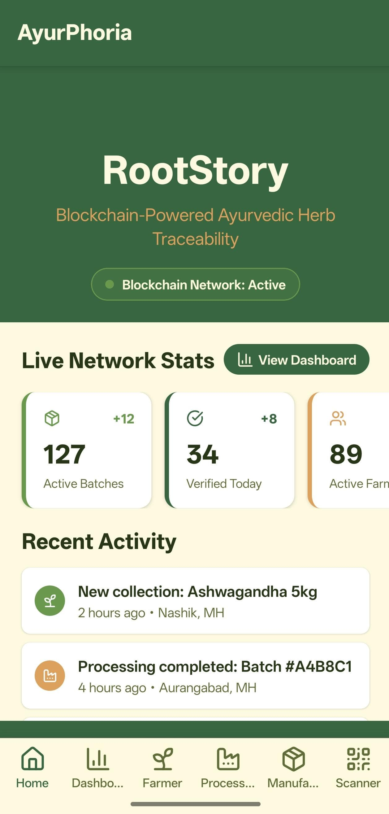
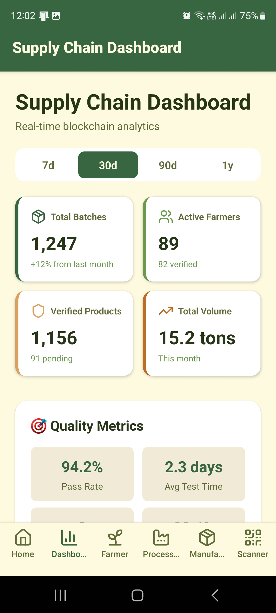
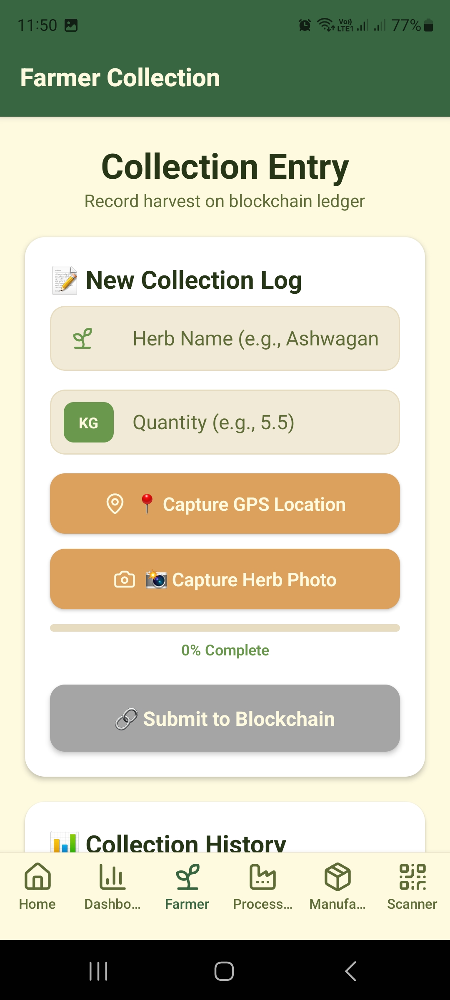
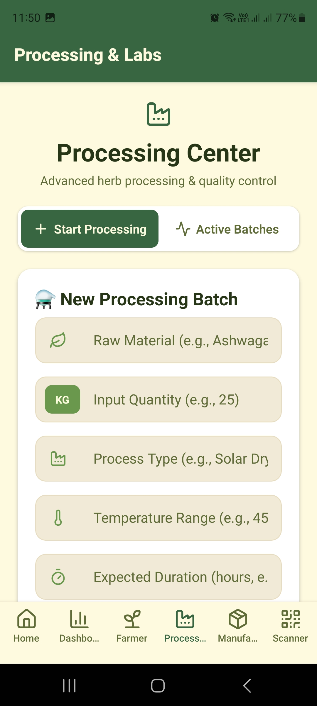
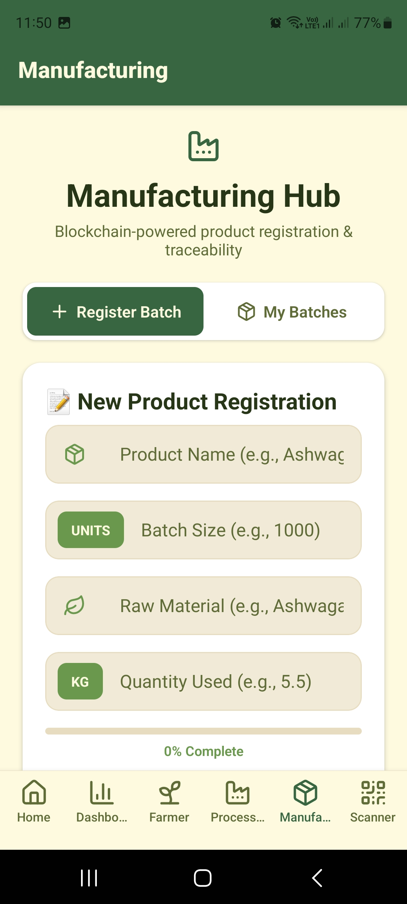
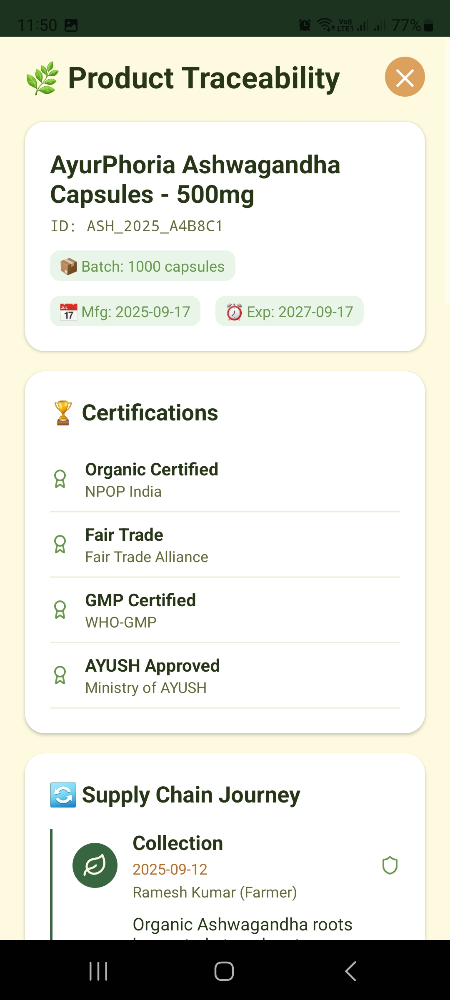
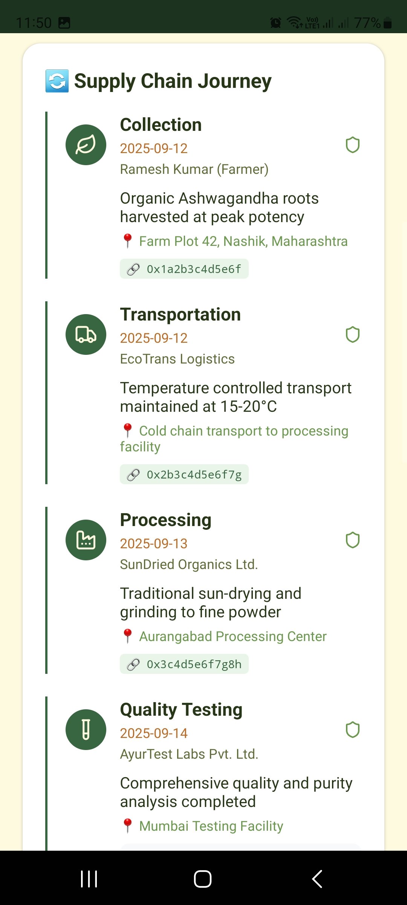
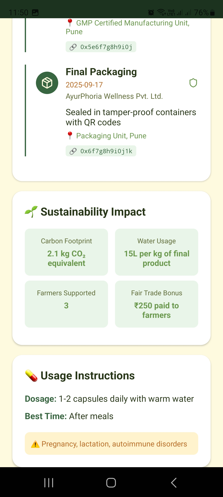

# 🌿 RootStory — Ayurphoria

> *Where ancient roots meet modern trust.*

RootStory (Ayurphoria) is an AI-powered mobile application that identifies medicinal herbs and records their provenance immutably on a blockchain. By combining a machine-learning herb classifier with Hyperledger Fabric smart contracts and real-time SMS notifications, RootStory brings transparency and authenticity to the world of Ayurvedic herbs.

---

## ✨ Features

- **🔍 AI Herb Classifier** — Snap a photo of any herb and get instant identification powered by a Python deep-learning model.
- **⛓️ Blockchain Provenance** — Every herb's journey from farm to consumer is recorded on a Hyperledger Fabric ledger via smart contracts, making records tamper-proof and auditable.
- **📲 SMS Notifications** — Real-time SMS alerts via a webhook integration keep stakeholders updated on herb status and transactions.
- **📱 Cross-Platform Mobile App** — Built with React Native + Expo, the app runs on both Android and iOS.
- **🎨 Smooth Animations** — Lottie animations for a polished, engaging user experience.

---

## Screenshots

<p align="center">
  
  
  
</p>

<p align="center">
  
  
</p>

### 📑 Reports & Analytics
<p align="center">
  
  
  
</p>

## 🏗️ Project Structure

```
RootStory/
├── app/                        # Expo Router screens & navigation
├── components/                 # Reusable React Native components
├── hooks/                      # Custom React hooks
├── constants/                  # App-wide constants & theme
├── assets/                     # Images, fonts, and static files
├── herb classifier/            # Python ML model for herb identification
├── smart contract backend/     # Hyperledger Fabric smart contracts & API
├── sms-webhook/                # SMS notification webhook server
├── app.json                    # Expo app configuration
└── package.json
```

---

## 🛠️ Tech Stack

| Layer | Technology |
|---|---|
| Mobile App | React Native, Expo (~54), Expo Router |
| Language | TypeScript (app), Python (ML model) |
| Blockchain | Hyperledger Fabric (`fabric-network`) |
| Backend / Webhook | Node.js, Express.js |
| ML / AI | Python (herb classification model) |
| Animations | Lottie React Native |
| Icons | Lucide React Native, Expo Vector Icons |

---

## 🚀 Getting Started

### Prerequisites

- [Node.js](https://nodejs.org/) (v18 or later)
- [Python 3.9+](https://www.python.org/)
- [Expo CLI](https://docs.expo.dev/get-started/installation/)
- [Expo Go](https://expo.dev/go) app on your phone (for quick testing)

### 1. Clone the repository

```bash
git clone https://github.com/Arshad4786/RootStory.git
cd RootStory
```

### 2. Install mobile app dependencies

```bash
npm install
```

### 3. Start the Expo development server

```bash
npx expo start
```

Then scan the QR code with Expo Go, or press:
- `a` — open on Android emulator
- `i` — open on iOS simulator
- `w` — open in browser

### 4. Set up the Herb Classifier

```bash
cd "herb classifier"
pip install -r requirements.txt
python app.py
```

### 5. Set up the Smart Contract Backend

```bash
cd "smart contract backend"
npm install
# Follow Hyperledger Fabric network setup instructions in that folder
```

### 6. Set up the SMS Webhook

```bash
cd sms-webhook
npm install
node index.js
```

---

## 📱 Running on a Physical Device

1. Install [Expo Go](https://expo.dev/go) from the App Store or Google Play.
2. Run `npx expo start` in the project root.
3. Scan the QR code shown in the terminal.

For a production-ready build, use [EAS Build](https://docs.expo.dev/build/introduction/):

```bash
npx eas build --platform android
npx eas build --platform ios
```

---

## 🤖 Herb Classifier

The herb classifier is a Python-based deep learning model that accepts an image and returns the predicted herb species along with a confidence score. It is served as a REST API that the mobile app calls after a user captures a photo.

- **Input**: Image (JPEG/PNG)
- **Output**: Herb name, confidence score, Ayurvedic properties
- **Integration**: Called from the mobile app via `expo-image-picker`

---

## ⛓️ Smart Contract Backend

The Hyperledger Fabric backend handles on-chain records for:

- Herb registration (origin, farmer, harvest date)
- Supply chain transfers
- Authenticity verification queries

Smart contracts are written for the Fabric network and exposed via an Express.js REST API consumed by the mobile app.

---

## 📩 SMS Webhook

The SMS webhook server uses `expo-sms` on the client side and a webhook on the backend to send automated alerts for events such as:

- Successful herb identification
- Blockchain record creation
- Supply chain status updates

---

## 📦 Key Dependencies

```json
{
  "expo": "~54.0.6",
  "expo-router": "~6.0.3",
  "expo-image-picker": "~17.0.8",
  "expo-sms": "~14.0.7",
  "fabric-network": "^2.2.20",
  "express": "^5.1.0",
  "lottie-react-native": "^7.3.4",
  "react-native-reanimated": "~4.1.0"
}
```

---

## 🤝 Contributing

Contributions are welcome! Please follow these steps:

1. Fork the repository.
2. Create a feature branch: `git checkout -b feature/your-feature-name`
3. Commit your changes: `git commit -m 'Add some feature'`
4. Push to the branch: `git push origin feature/your-feature-name`
5. Open a Pull Request.

---

## 📄 License

This project is private. All rights reserved © Arshad4786.

---

## 🙏 Acknowledgements

- [Expo](https://expo.dev) — for the amazing React Native toolchain
- [Hyperledger Fabric](https://hyperledger-fabric.readthedocs.io/) — for enterprise-grade blockchain infrastructure
- The Ayurvedic knowledge community for inspiration

---

*Built with ❤️ for transparency in traditional medicine.*
